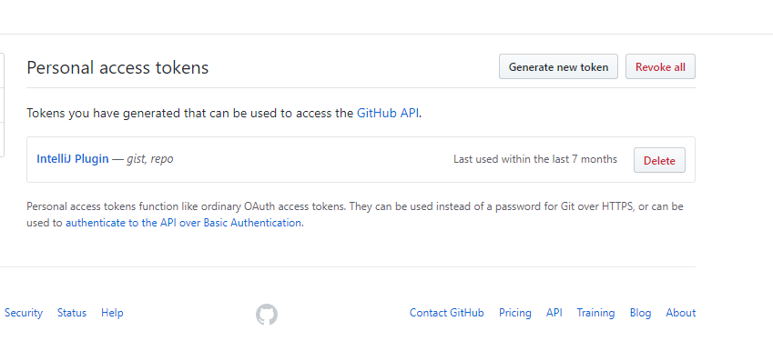
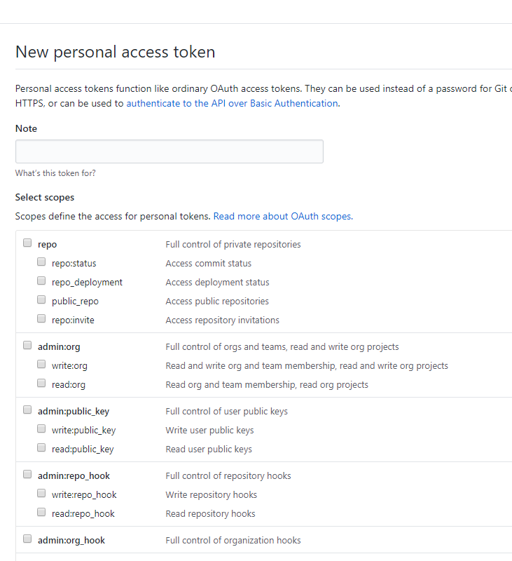
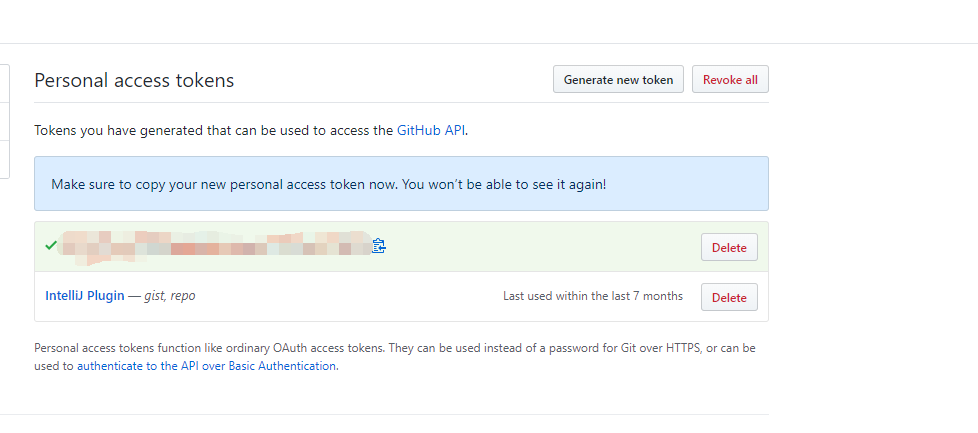
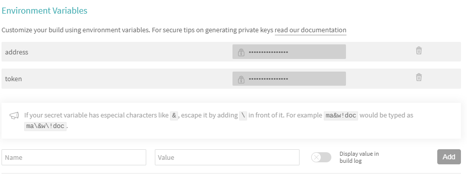
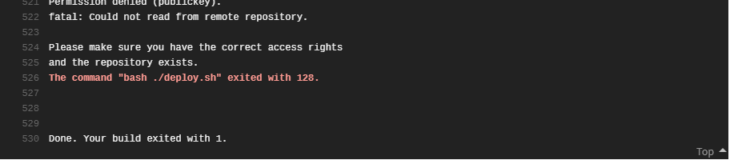

# 关于博客

这个博客是基于Vuepress1.X来搭建的。记录一些技术方面的知识。下面是介绍怎么用Vuepress从头开始搭建一个技术博客。

## Vuperss简介

[Vuepress](https://v1.vuepress.vuejs.org/zh/)是Vue生态中关于静态网站的一个生成器，对于技术类型博客支持很好，配置少，上手快，UI风格讨人喜欢。这个博客网站使用的是Vuepress1.x来进行搭建的。除了这个博客之外下面的网站也是使用的vuepress

* [vuepress](https://v1.vuepress.vuejs.org/)
* [vue](https://cn.vuejs.org/index.html)

## 开始

* 默认你的电脑上有[Node](https://nodejs.org/zh-cn/)环境
* **Node.js**的版本大于**8.6**
* 如果已经阅读过官方文档最好不过

## 安装vuepress

在这个博客使用的是vuepress1.X所以安装的时候需要这样安装：

```js
    yarn global add vuepress@next // OR npm install -g vuepress@next

```

如果想要使用vuepress0.X,按照下面的安装方式，

```js
    yarn global add vuepress // OR npm install -g vuepress
```

对于新手搭建博客这两个版本的区别不大，这个博客中建议使用vuepress1.X。

## 搭建博客项目

一共分为四个部分

* 搭建一个初始项目并且能用vuepress来写博客
* 配置导航和侧边栏
* 构建并且发布
* 自动化部署

### 第一部分

新建write-blog文件夹,并且初始化项目,在第一部分中

```bash

mkdir writ-blog


```

## travis自动化部署

对于[travis](https://travis-ci.org/),如果你还没有听说过，那么这里有一篇[入门的教程](http://www.ruanyifeng.com/blog/2017/12/travis_ci_tutorial.html)供你参考。在这个环节里，分为三部分：

* 用你的github账号登陆travis网站
* 在github上面申请Personal access tokens
* 在travis中设置环境变量

### 申请Personal access tokens

去[github setting](https://github.com/settings/tokens)申请一个Personal access tokens

点击Generate new token

随便起一个Note,然后把所有的都给勾选上，然后点击Generate token这个按钮，结果大概是这样的
,然后点击后面的复制按钮图标，留作第二步使用;

### 设置Environment Variables :100:

 去travis上你的项目中的More OPtions(下图中右上角):
 
 中找到Settings,再在Environment Variables中添加环境变量,我添加的类似于下图，
 
 图中的token后面的内容就是第一步中复制的内容，address的内容是我的github项目的地址。添加完毕之后，在项目中的deploy.sh文件中修改git push 的内容，如下:

```bash
!/usr/bin/env sh

# 确保脚本抛出遇到的错误
set -e
npm install -g vuepress@next
# 生成静态文件
npm run build

# 进入生成的文件夹
cd docs/.vuepress/dist

# 如果是发布到自定义域名
# echo 'www.example.com' > CNAME

git init
git add -A
git commit -m 'deploy'

# 如果发布到 https://<USERNAME>.github.io
git push -f https://${token}@${address} master:master

# 如果发布到 https://<USERNAME>.github.io/<REPO>
# git push -f git@github.com:<USERNAME>/<REPO>.git master:gh-pages

cd -
```

这样，在提交代码的时候就不用每次都去```npm run deploy```了

### 报错

当初部署的时候，并没有去github申请token导致在travis上报错,如果遇到这个报错：

说明没有权限往git仓库上提交代码，那么这个时候就需要重复撒谎给你一个步骤：travis自动化部署。
