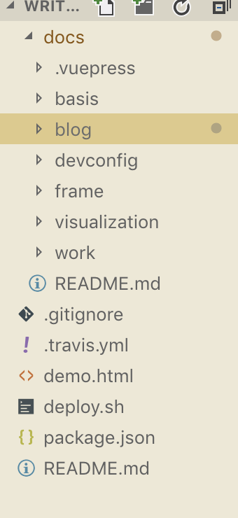
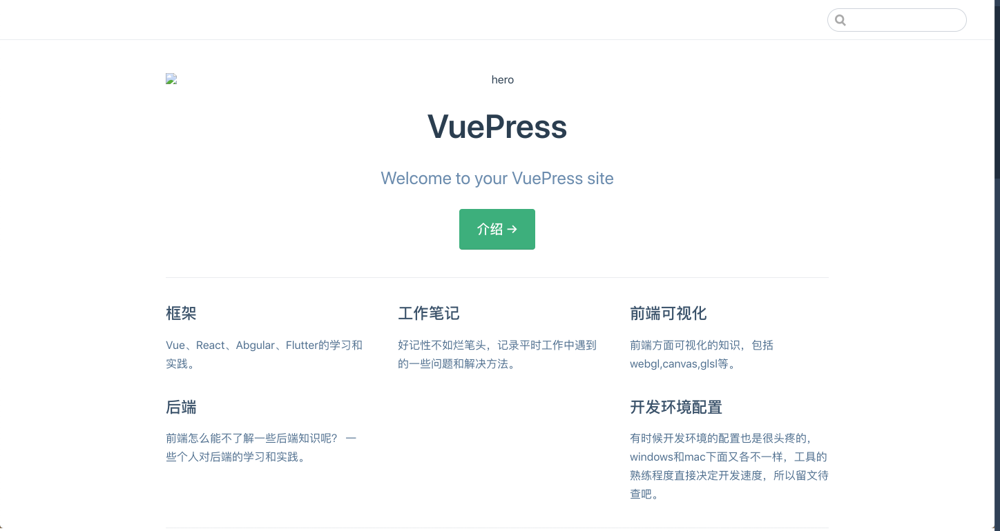
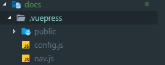
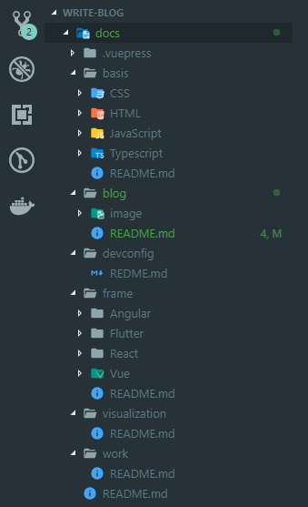
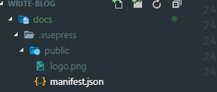
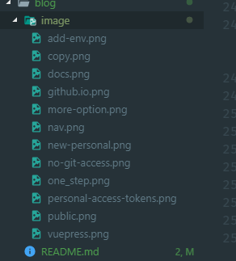
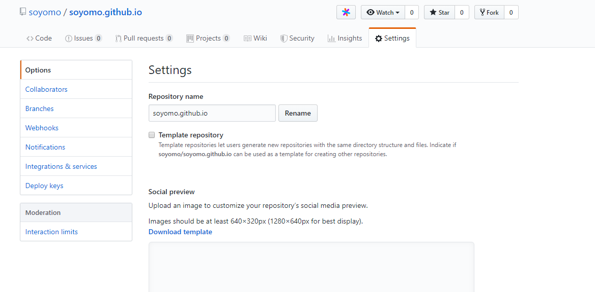
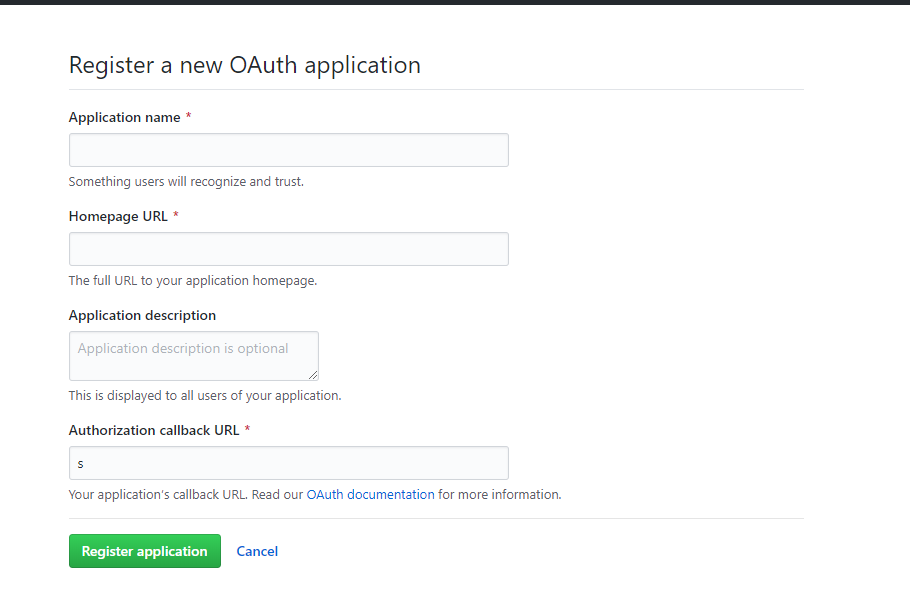

# 关于博客

这个博客是基于Vuepress1.X来搭建的。记录一些技术方面的知识。下面是介绍怎么用Vuepress从头开始搭建一个技术博客。

## Vuperss简介

[Vuepress](https://v1.vuepress.vuejs.org/zh/)是Vue生态中关于静态网站的一个生成器，对于技术类型博客支持很好，配置少，上手快，UI风格讨人喜欢。这个博客网站使用的是Vuepress1.x来进行搭建的。除了这个博客之外下面的网站也是使用的vuepress

* [vuepress](https://v1.vuepress.vuejs.org/)
* [vue](https://cn.vuejs.org/index.html)

## 开始

* 默认你的电脑上有[Node](https://nodejs.org/zh-cn/)环境
* **Node.js**的版本大于**8.6**
* 如果已经阅读过官方文档最好不过

:::warning 注意
本篇教程一共会在github上面建立两个项目，一个用来写博客，另外一个用来展示博客。其实也可以合成一个项目，看个人喜好。
:::

## 安装vuepress

在这个博客使用的是vuepress1.X所以安装的时候需要这样安装：

```js
    yarn global add vuepress@next // OR npm install -g vuepress@next

```

如果想要使用vuepress0.X,按照下面的安装方式，

```js
    yarn global add vuepress // OR npm install -g vuepress
```

对于新手搭建博客这两个版本的区别不大，这个博客中建议使用vuepress1.X。

## 搭建博客项目

一共分为四个部分

* 搭建一个初始项目并且能用vuepress来写博客
* 配置导航和侧边栏
* 构建并且发布
* 自动化部署

开始之前我先放一个我的博客的目录结构：



## 第一部分：搭建项目

新建write-blog文件夹,并且初始化项目,在第一部分中

```bash

mkdir writ-blog
cd writ-blog
npm init -y
mkdir docs // 这个文件夹是放置所有博客的地方
cd docs
touch README.md //创建reademe文件，即首页

```

初始化的目录结构如下所示：

``` vue
.
├─ docs
│  └─ README.md
└─ package.json
```

::: warning 注意
docs文件夹是你所有博客所在的文件夹，docs文件夹根目录下的README.md 文件在经过vuepress的编译之后会成为你的博客网站的首页！！！
:::
在docs跟目录中的README.md文件中写上以下内容：

```yaml
---
home: true
heroImage: /logo.png
actionText: 介绍 →
actionLink: /blog/
features:
- title: 框架
  details: Vue、React、Abgular、Flutter的学习和实践。
- title: 工作笔记
  details: 好记性不如烂笔头，记录平时工作中遇到的一些问题和解决方法。
- title: 前端可视化
  details: 前端方面可视化的知识，包括webgl,canvas,glsl等。
- title: 后端
  details: 前端怎么能不了解一些后端知识呢？ 一些个人对后端的学习和实践。
- title: 开发环境配置
  details: 有时候开发环境的配置也是很头疼的，windows和mac下面又各不一样，工具的熟练程度直接决定开发速度，所以留文待查吧。
footer: MIT Licensed | Copyright © 2019-present chenfeng
---
```

::: warning 注意
这个文件就是你博客的首页(index.html)，```'home: true'```,是必须的
:::

初始化之后，在package.json中的script中添加两个命令：

```js

"dev": "vuepress dev docs",
"build": "vuepress build docs",

```

然后执行```npm run dev```，在浏览器中打开[服务](http://localhost:8080),会出现一个页面，大概长得是这个样子,到这里第一步就已经完成了，你已经可以写博客了，但是远远不能满足咱们的需求，这个时候就需要配置导航和侧边栏了。

## 第二部分：配置导航和侧边栏

第二部分的目录结构如下：

```vue
.
├─ .vuepress
│  └─ config.js
├─ docs
│  └─ README.md
└─ package.json
```

你会注意到这一步多出了一个```.vuepres```的文件夹，有关vuepress的配置，都在这个文件夹之中，下面介绍一下有关导航栏和侧边栏的配置。```.vuepress/config```中的基本配置如下：

```js

module.exports = {
    title: 'chenfeng\'s blog',
    description: 'chenfeng的个人博客',
}
```

当你完成上述步骤的话，你在本地起的dev环境所呈现的网页应该包含一个页头,和一个描述。

下面这个配置内容是我的网站的配置：

```js

module.exports = {
    title: 'chenfeng\'s blog',
    description: 'chenfeng的个人博客',
    head: [ // 注入到当前页面的 HTML <head> 中的标签
        ['link', { rel: 'icon', href: '/logo.png' }], // 增加一个自定义的 favicon(网页标签的图标)
        ['link', { rel: 'manifest', href: '/logo.png' }],
        ['link', { rel: 'apple-touch-icon', href: '/logo.png' }],
        ['link', { rel: 'mask-icon', href: '/logo.png', color: '#3eaf7c' }],
        ['meta', { 'http-quiv': 'pragma', cotent: 'no-cache' }],
        ['meta', { 'http-quiv': 'expires', cotent: '0' }],
        ['meta', { 'http-quiv': 'pragma', cotent: 'no-cache, must-revalidate' }]
    ],
    serviceWorker: true, // 是否开启 PWA
    base: '/', // 这是部署到github相关的配置
    markdown: {
        lineNumbers: true // 代码块显示行号
    },
    themeConfig: {
        nav: [
            { text: '主页', link: '/' },
            {
                text: '基础', items: [
                    { text: 'JavaScript', link: '/basis/JavaScript/' },
                    { text: 'HTML', link: '/basis/HTML/' },
                    { text: 'CSS', link: '/basis/CSS/' },
                    { text: 'TypeScript', link: '/basis/CSS/' },
                ]
            },
            {
                text: '框架', items: [
                    { text: 'Vue', link: '/frame/Vue/' },
                    { text: 'React', link: '/frame/React/' },
                    { text: 'Angular', link: '/frame/Angular/' },
                    { text: 'Flutter', link: '/frame/Flutter/' }
                ]
            },
            { text: '工作笔记', link: '/work/' },
            { text: '前端可视化', link: '/visualization/' },
            { text: '环境配置', link: '/devconfig/' },
            { text: 'Github', link: 'https://github.com/soyomo' }
        ],
        sidebar: {
            '/blog/': getSidebar('blog'),
            '/frame/': getSidebar('frame'),
            '/basis/': getSidebar('basis')
        },
        sidebarDepth: 2, // 侧边栏显示2级
    }
};

function getSidebar(barName) {
    const sidebar = {
        frame: [
            '/frame/',
            '/frame/Vue/',
            '/frame/React/',
            '/frame/Angular/'
        ],
        blog: [
            '/blog/'
        ],
        basis: [

        ]
    }
    return sidebar[barName]
}
```

如果你感觉文件太长的话，可以单独把nav和sidebar提到另外一个独立的文件之中。我的```.vuepress```的文件目录结构是这样的：



其中```nav.js```的内容如下所示：

```javascript
module.exports = [
    { text: '主页', link: '/' },
    {
        text: '基础', items: [
            { text: 'JavaScript', link: '/basis/JavaScript/' },
            { text: 'HTML', link: '/basis/HTML/' },
            { text: 'CSS', link: '/basis/CSS/' },
            { text: 'TypeScript', link: '/basis/CSS/' },
        ]
    },
    {
        text: '框架', items: [
            { text: 'Vue', link: '/frame/Vue/' },
            { text: 'React', link: '/frame/React/' },
            { text: 'Angular', link: '/frame/Angular/' },
            { text: 'Flutter', link: '/frame/Flutter/' }
        ]
    },
    { text: '工作笔记', link: '/work/' },
    { text: '前端可视化', link: '/visualization/' },
    { text: '环境配置', link: '/devconfig/' },
    { text: 'Github', link: 'https://github.com/soyomo' }
]
```

然后把这个文件引入到```config.js```中就可以了.这个时候的导航还是不能工作的，因为你会找不到路径。所以需要把导航对应的文件夹都建立好，这些文件夹都是建立在```docs```的跟目录中的，博客每个页面对应的文件都是在docs的跟目录下的！！！这些文件夹建立好之后，都要创建一个README.md的文件，因为当你的路径只写文件夹的时候，这个文件在vuepress中是路径默认匹配的。我的docs的文件目录如下：



这个时候运行项目,每一个导航栏对应的页面应该时空白页面。

关于```docs/.vuepress/public```这个文件夹:



是存放公共的资源的，我把我博客的logo放到了这个文件夹中，每篇博客的静态资源建议放到该篇博客的目录下而不是都放到public之中。例如：本片教程中的图片我都放到了这篇文章对应的目录下面:



**blog**文件夹的路径：```write-blog/docs/blog```;

关于**pwa**的**manifest**配置也是需要放到这个文件夹中的。
manifest.json的内容：

```js
{
    "name": "chenfeng",
    "short_name": "feng",
    "start_url": "index.html",
    "display": "standalone",
    "background_color": "#2196f3",
    "description": "个人网站",
    "theme_color": "blue",
    "icons": [
      {
        "src": "./logo.jpg",
        "sizes": "144x144",
        "type": "image/png"
      }
    ],
    "related_applications": [
      {
        "platform": "web"
      },
      {
        "platform": "play",
        "url": "https://play.google.com/store/apps/details?id=cheeaun.hackerweb"
      }
    ]
  }

```

到此为止，第二部分就完毕了。

## 第三部分:构建并且发布

在这个部分中你需要在github上新建一个项目，我的项目是[项目](https://github.com/soyomo/soyomo.github.io)，其实这个项目就是所谓的GitHub Pages，新建好项目之后需要在该项目的setings中，,把你的项目的名称改为```{你的用户名}.github.io```,然后你就拥有了一个gitpage,就可以直接通过该链接访问了。[https://{username}.github.io/](https://{username}.github.io/);
做完这些之后，需要在你的write-blog项目中的package.json中添加以下命令：

```js
 "scripts": {
    "dev": "vuepress dev docs",
    "build": "vuepress build docs",
    "deploy": "bash deploy.sh",
  },
```

并且在```write-blog```文件的跟目录下新建一个```deploy.sh```文件,内容如下：

```bash
#!/usr/bin/env sh

# 确保脚本抛出遇到的错误
set -e
npm install -g vuepress@next
# 生成静态文件
npm run build

# 进入生成的文件夹
cd docs/.vuepress/dist

# 如果是发布到自定义域名
# echo 'www.example.com' > CNAME

git init
git add -A
git commit -m 'deploy'

# 如果发布到 https://<USERNAME>.github.io
# git push -f https://${token}@${address} master:master
git push -f git@github.com:{你的用户名}/{你的用户名}.github.io.git master

# 如果发布到 https://<USERNAME>.github.io/<REPO>
# git push -f git@github.com:<USERNAME>/<REPO>.git master:gh-pages

cd -
```

然后，执行```npm run deploy```，之后就会发布到```{username}.github.io```这个项目中去了，并且通过连接是可以访问的。这样就基本可以实现书写博客了，但是每次写完都得去```npm run deploy```一下，并不是很友好，那么自动化部署就会帮到你了。

## 第四部分：travis自动化部署

对于[travis](https://travis-ci.org/),如果你还没有听说过，那么这里有一篇[入门的教程](http://www.ruanyifeng.com/blog/2017/12/travis_ci_tutorial.html)供你参考。在这个环节里，分为三部分：

* 用你的github账号登陆travis网站
* 在github上面申请Personal access tokens
* 在travis中设置环境变量

### 申请Personal access tokens

去[github setting](https://github.com/settings/tokens)申请一个Personal access tokens

点击Generate new token

随便起一个Note,然后把所有的都给勾选上，然后点击Generate token这个按钮，结果大概是这样的
,然后点击后面的复制按钮图标，留作第二步使用;

### 设置Environment Variables :100:

 去travis上你的项目中的More OPtions(下图中右上角):
 
 中找到Settings,再在Environment Variables中添加环境变量,我添加的类似于下图，
 
 图中的token后面的内容就是第一步中复制的内容，address的内容是我的github项目的地址（```github.com/soyomo/soyomo.github.io.git```）。添加完毕之后，在项目中的deploy.sh文件中修改git push 的内容，如下:

```bash
!/usr/bin/env sh

# 确保脚本抛出遇到的错误
set -e
npm install -g vuepress@next
# 生成静态文件
npm run build

# 进入生成的文件夹
cd docs/.vuepress/dist

# 如果是发布到自定义域名
# echo 'www.example.com' > CNAME

git init
git add -A
git commit -m 'deploy'

# 如果发布到 https://<USERNAME>.github.io
git push -f https://${token}@${address} master:master

# 如果发布到 https://<USERNAME>.github.io/<REPO>
# git push -f git@github.com:<USERNAME>/<REPO>.git master:gh-pages

cd -
```

然后，在项目的跟目录下面创建一个```.travis.yml```文件，内容如下：

```yml
sudo: required
language: node_js
node_js: stable
script: bash ./deploy.sh
branches:
  only:
  - master
notifications:
  email: false
```

这样，当你每次提交write-blog项目的修改的时候，travis就会自动的帮你构建你的```{username}.github.io```项目了。

### 报错

当初部署的时候，并没有去github申请token导致在travis上报错,如果遇到这个报错：

说明没有权限往git仓库上提交代码，那么这个时候就需要重复第四个步骤：travis自动化部署。

### 后续

上面的步骤都做好之后，一个简单的博客网站就已经在你的手中诞生了，这个时候应该去买杯咖啡或者吃顿大餐来犒赏一下自己:tada: :tada: :tada:,但是这个博客并没有可以评论的地方怎么办呢？

## 添加评论系统

在添加评论之前你需要准备clientID和clientSecret，这两个东西的生成是在这里[Register a new OAuth application](https://github.com/settings/applications/new),除了Authorization callback URL之外，剩余的三项是可以随便填写的，Authorization callback URL中的回调url一般指向的是你的博客地址，我的填写的是‘https://soyomo.github.io’，点击Register application 之后会跳转一个新页面你就会看到clientID和clientSecret了。然后接下来就是添加系统评论的部分了。

我的博客现在使用的是：Vssue.[Vssue](https://vssue.js.org/zh/b)是一个vue驱动的基于Issue的插件，在vuepress中使用它十分方便。[这里](https://vssue.js.org/zh/guide/vuepress.html)是官方关于在vuepress中使用Vssue的说明文档，如果你不想看也没关系其实一共也就两步。

### 第一步安装插件

```js
npm install @vssue/vuepress-plugin-vssue
npm install @vssue/api-github-v3
```

## 第二步使用插件

在```.vuepress/config.js```中添加plugins:

```js
plugins: {
    '@vssue/vuepress-plugin-vssue': {
      // 设置 `platform` 而不是 `api`
      platform: 'github',
      locale: 'zh', // 语言设置

      // 其他的 Vssue 配置
      owner: 'OWNER_OF_REPO', // 你的github账户名称
      repo: 'NAME_OF_REPO', // 你的Github博客仓库 我填的是soyomo
      clientId: 'YOUR_CLIENT_ID', // 你在github上面申请的clientId
      clientSecret: 'YOUR_CLIENT_SECRET', // 在github上面申请的clientSecret
    },
  },

```

然后以组件的方式在md文档中使用,也就是在md文档的最底部加上这样一句就行：

```js
<Vssue title="Vssue Demo" />
```

## 评论系统的另一种选择

我的博客第一版的里面用的是[gittalk](https://github.com/gitalk/gitalk)来实现评论的，gittalk的原理就是利用github的issue来实现评论博客的。具体的实现是在```.vuepress/enhanceApp.js```文件中。关于[enhanceApp.js](https://v1.vuepress.vuejs.org/zh/guide/basic-config.html#%E5%BA%94%E7%94%A8%E7%BA%A7%E5%88%AB%E7%9A%84%E9%85%8D%E7%BD%AE)的内容可以参考vuepress的[官方文档](https://v1.vuepress.vuejs.org/zh/guide/basic-config.html#%E5%BA%94%E7%94%A8%E7%BA%A7%E5%88%AB%E7%9A%84%E9%85%8D%E7%BD%AE),在这个博客项目中就只需要在该文件中输入以下代码就可以了：

```js

function integrateGitalk(router) {
    const linkGitalk = document.createElement('link');
    linkGitalk.href = 'https://cdn.jsdelivr.net/npm/gitalk@1/dist/gitalk.css';
    linkGitalk.rel = 'stylesheet';
    document.body.appendChild(linkGitalk);
    const scriptGitalk = document.createElement('script');
    scriptGitalk.src = 'https://cdn.jsdelivr.net/npm/gitalk@1/dist/gitalk.min.js';
    document.body.appendChild(scriptGitalk);
  
    router.afterEach((to) => {
      if (scriptGitalk.onload) {
        loadGitalk(to);
      } else {
        scriptGitalk.onload = () => {
          loadGitalk(to);
        }
      }
    });
  
    function loadGitalk(to) {
      let commentsContainer = document.getElementById('gitalk-container');
      if (!commentsContainer) {
        commentsContainer = document.createElement('div');
        commentsContainer.id = 'gitalk-container';
        commentsContainer.classList.add('content');
      }
      const $page = document.querySelector('.page');
      if ($page) {
        $page.appendChild(commentsContainer);
        if (typeof Gitalk !== 'undefined' && Gitalk instanceof Function) {
          renderGitalk(to.fullPath);
        }
      }
    }
    function renderGitalk(fullPath) {
      const gitalk = new Gitalk({
        clientID: '****', // 在github上生成的
        clientSecret: '****', // 在github上生成的 come from github development
        repo: '****', // 你的博客的仓库名称
        owner: '****', // 你在githug上的用户名称
        admin: ['****'], // 管理成员
        id: 'comment',
        distractionFreeMode: false,
        language: 'zh-CN',
      });
      gitalk.render('gitalk-container');
    }
  }
  
  export default ({Vue, options, router}) => {
    try {
      document && integrateGitalk(router)
    } catch (e) {
      console.error(e.message)
    }
  }

```

:::warning
需要注意的是因为在开发环境中我们的项目使用的是‘write-blog’，而配置中的repo填写的是博客的项目名称，就会导致在开发环境中登陆不成功，但是如果开发环境中已经有关于评论的部分的话，就说明已经配置成功了。
:::

<Vssue title="blog" />
