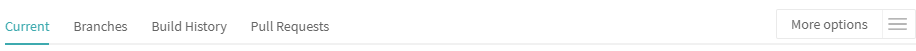

# 关于博客

这个博客是基于Vuepress1.X来搭建的。记录一些技术方面的知识。下面是介绍怎么用Vuepress从头开始搭建一个技术博客。

## Vuperss简介

[Vuepress](https://v1.vuepress.vuejs.org/zh/)是Vue生态中关于静态网站的一个生成器，对于技术类型博客支持很好，配置少，上手快，UI风格讨人喜欢。这个博客网站使用的是Vuepress1.x来进行搭建的。

## 开始

在开始之前，默认确保你的电脑上面是有[Node](https://nodejs.org/zh-cn/)环境的，并且确保Node.js的版本大于8.6;如果已经阅读过官方文档最好不过。

## travis自动化部署

如果遇到这个报错：，说明没有权限往git仓库上提交代码，那么这个时候就需要三步来解决：

### 1. 申请Personal access tokens

去[github setting](https://github.com/settings/tokens)申请一个Personal access tokens

点击Generate new token

随便起一个Note,然后把所有的都给勾选上，然后点击Generate token这个按钮，结果大概是这样的
,然后点击后面的复制按钮图标，留作第二步使用;

### 2. travis中设置 Environment Variables

 去travis上你的项目中的More OPtions:
 
 中找到Settings,再在Environment Variables中添加环境变量
